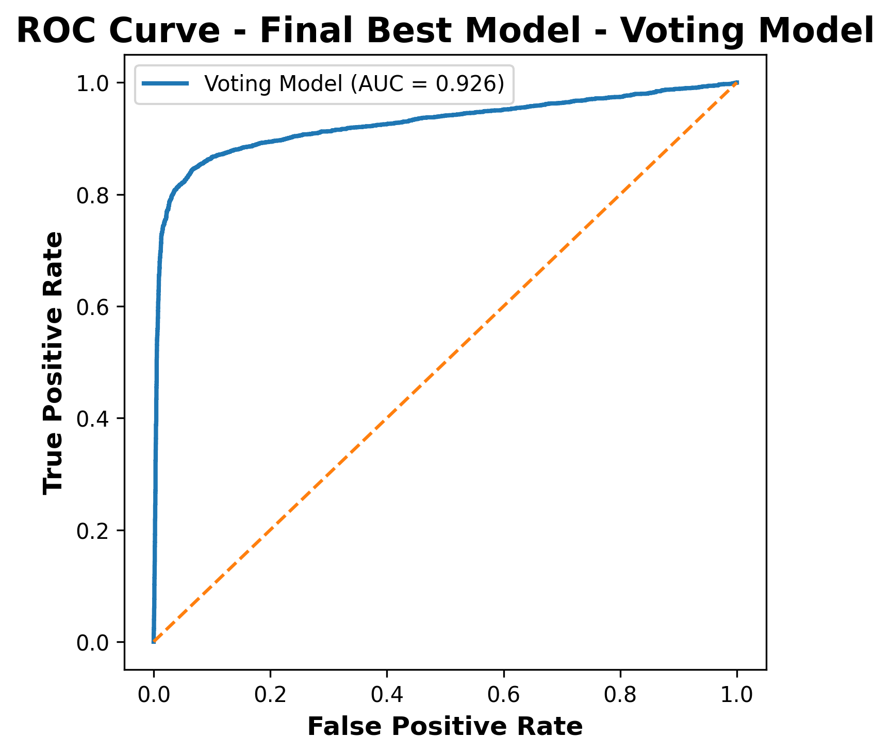

# Customer Churn Prediction with Machine Learning


## Project Overview

Customer churn prediction is an important problem for many businesses.  
Identifying customers who are likely to leave allows companies to proactively improve retention strategies and reduce revenue loss.

This project builds a **machine learning pipeline to predict customer churn**, including:

- Exploratory Data Analysis (EDA)
- Feature Selection
- Model Training
- Hyperparameter Optimization
- Model Evaluation

The final model uses **ensemble learning** to improve predictive performance.

## Machine Learning Workflow

Data Exploration → Feature Selection → Model Training → Hyperparameter Tuning → Model Evaluation

---

## Model Performance



## Model Comparison

| Model               | Accuracy |
| ------------------- | -------- |
| Logistic Regression | 0.78     |
| Random Forest       | 0.84     |
| Gradient Boosting   | 0.86     |
| Voting Classifier   | 0.88     |

The ensemble **Voting Classifier** achieved the best performance by combining predictions from multiple models.

---

## Dataset Analysis

Exploratory Data Analysis was conducted to understand the relationships between customer behavior and churn.

Key analysis includes:

- Feature distribution visualization
- Feature vs target relationship
- Correlation analysis

These insights help identify which customer behaviors most strongly influence churn.

Examples of insights:

- Lower engagement often correlates with higher churn probability
- Customer support interactions can indicate dissatisfaction
- Some behavioral features have stronger predictive power than demographic features

---

## Feature Selection

To improve model efficiency and reduce noise, two feature selection methods were applied:

### Chi-Square Filtering

Used to identify statistically significant features related to churn.

### Recursive Feature Elimination (RFE)

Iteratively removes weaker features while maintaining model performance.

This process improves model interpretability and reduces overfitting.

---

## Models Implemented

Several machine learning models were trained and compared:

| Model               | Description                                  |
| ------------------- | -------------------------------------------- |
| Logistic Regression | Baseline classification model                |
| Random Forest       | Tree-based ensemble model                    |
| Gradient Boosting   | Sequential boosting model                    |
| Voting Classifier   | Ensemble model combining multiple algorithms |

The **Voting Classifier** achieved the best performance.

---

## Hyperparameter Optimization

Hyperparameter tuning was performed using:

- **RandomizedSearchCV**
- **Cross-validation**

This step ensures the models are optimized and generalize well to unseen data.

---

## Model Evaluation

Models were evaluated using multiple metrics:

| Metric    | Purpose                              |
| --------- | ------------------------------------ |
| Accuracy  | Overall prediction correctness       |
| Precision | Correct positive predictions         |
| Recall    | Ability to detect churn customers    |
| F1-score  | Balance between precision and recall |
| ROC Curve | Overall classification performance   |

The final ensemble model achieved strong performance on both training and test datasets.

## Example Visualizations


---

## Project Structure

```text
ml_customer_churn_prediction
│
├── figures
│   ├── figure1_feature_histograms.png
│   ├── figure2_features_vs_churn.png
│   ├── figure3_correlation_heatmap.png
│   └── figure4_roc_curve.png
│
├── customer_churn_prediction.ipynb
├── ecommerce_customer_churn_dataset.csv
└── README.md
```

---

## Technologies Used

### Programming Language

- Python

### Data Analysis

- Pandas
- NumPy

### Machine Learning

- Scikit-learn

### Visualization

- Matplotlib
- Seaborn

---

## How to Run the Project

Clone the repository:

```bash
git clone https://github.com/Melissa-Shao/ml_customer_churn_prediction
```

Install dependencies:

```bash
pip install pandas numpy scikit-learn matplotlib seaborn
```

Run the notebook:

```bash
jupyter notebook
```

Open the notebook and run all cells.

---

## Key Takeaways

This project demonstrates an **end-to-end machine learning workflow**, including:

- Data analysis and visualization
- Feature engineering and selection
- Training multiple machine learning models
- Model optimization and evaluation

It highlights how machine learning can support **data-driven decision making** for customer retention.

---

## Future Improvements

Potential improvements include:

- Applying advanced models such as **XGBoost or LightGBM**
- Handling class imbalance using **SMOTE**
- Building a **model deployment API**
- Creating an interactive dashboard for churn prediction

---

## Author

Melissa Shao

[](https://github.com/Melissa-Shao)
